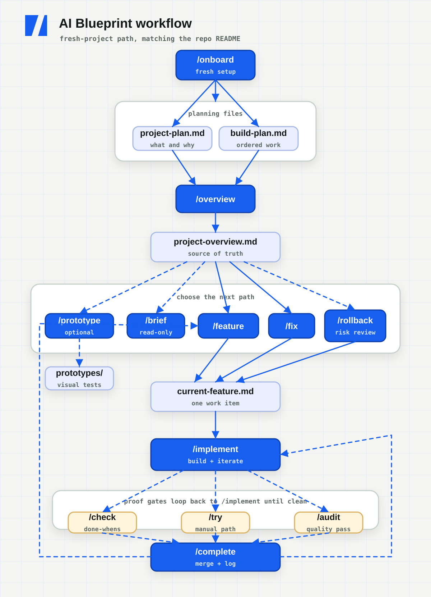

# AI Blueprint

A starter and repeatable workflow for building real software with an AI assistant,
**without vibe coding**.

[Official site](https://ai-blueprint.dev) | [Documentation](https://ai-blueprint.dev/docs/)

You provide two short planning docs. The AI turns them into project context,
feature specs, and build steps. You build one feature at a time, review every
spec before code exists, and review every diff before it lands.

## What this is

Vibe coding is describing a vague thing and accepting whatever the AI returns.
It is fast until it is not: you end up with code nobody understands and a project
that cannot be changed safely.

This blueprint gives the AI a controlled loop:

1. **Spec before code.** Planning skills write a spec and stop. You review it
   before a single line of code is written.
2. **Small, reviewable steps.** Each implementation step ends with something
   observable, a diff you can read, and proof that the done-when was met.
3. **One work item at a time.** `blueprint/context/current-feature.md` holds
   exactly one feature, fix, or rollback. Finish it, archive it, then move on.

The point is not to type less. It is to stay in control of a codebase the AI is
helping you write.

## At a glance

| Principle | What it means |
| ---- | ---- |
| Spec first | The AI writes a feature or fix spec, then stops for review before code. |
| Small diffs | Implementation happens one reviewed step at a time, with proof each step works. |
| File-backed state | Plans, current work, and history live in markdown files, so context clears are survivable. |
| Tool adapters | Codex uses `.agents/skills`; Claude Code uses `.claude/skills`. |
| Optional visibility | Commit the workflow files for portability, or keep them local with `.gitignore`. |

## Quick start

Scaffold the app first, then install the Blueprint.

> [!IMPORTANT]
> Scaffold your app first, then install the Blueprint. Do not run a framework
> scaffolder inside a folder that already contains Blueprint files.

**1. Scaffold your app** in a new, empty directory. Next.js is only an example
here; use any stack or scaffolder you want:

```bash
npx create-next-app@latest my-app
cd my-app
```

Make sure the app is a **git repo**. The build loop works on branches and
squash-merges. Some scaffolders run `git init` for you; if yours does not, run it
yourself:

```bash
git init
```

**2. Add the blueprint** from inside the app:

```bash
npx create-ai-blueprint@latest
```

You can also run `npm create ai-blueprint@latest`.

The installer asks which AI tool adapters you want and adds only the Blueprint
workflow files your app needs.

> [!IMPORTANT]
> After installing, run `/onboard` before filling in plans or running
> `/overview`. This is the setup pass that makes the Blueprint match your actual
> project. If Claude Code was already open when the Blueprint was installed,
> restart Claude Code in that folder so the newly added project skills appear.

**3. Run onboard before anything else.** This detects the stack and may edit the
setup files that ship with the overlay: `AGENTS.md` commands, the `CLAUDE.md`
project title when present, `blueprint/context/coding-standards.md`,
`blueprint/context/ai-interaction.md`, `.gitignore`, adapter recommendations, and
README placement. It also asks whether Blueprint workflow files should be
committed or kept local-only through `.gitignore`:

```text
/onboard
```

In Codex, invoke it as `$onboard`. In Claude Code, invoke it as `/onboard`.

**4. Review the setup.** Skim
[blueprint/context/coding-standards.md](blueprint/context/coding-standards.md) and
[blueprint/context/ai-interaction.md](blueprint/context/ai-interaction.md). Adjust
anything `/onboard` flagged or anything that does not match how you want to work.
If something feels off, run `/doctor`; it is a read-only health check for the
Blueprint setup.

**5. Plan the app.** Fill in the two files you own:

- [blueprint/project-plan.md](blueprint/project-plan.md)
- [blueprint/build-plan.md](blueprint/build-plan.md)

The project plan can be rough notes. The build plan should become a numbered
checkbox list because the build loop uses checked and unchecked items to know
what is next. If your first pass is just bullets, `/overview` will flag that and
can propose a cleaned-up checkbox version before generating context.

**6. Generate the overview once.** This checks the two planning docs, helps shape
the build plan if needed, then turns them into
`blueprint/context/project-overview.md`, the AI-facing source of truth:

```text
/overview
```

Re-run `/overview` only when `project-plan.md` or `build-plan.md` changes.

**7. Repeat the build loop.** Once the overview exists, build one feature or fix
at a time:

```text
/feature
/implement
/check
/complete
```

That loop specs the next feature, builds it, proves it works, then archives and
merges it.

In Codex, invoke the same steps as skills (`$overview`, `$feature`, `$implement`,
`$check`, `$complete`) or ask naturally, such as "run the overview." In Claude
Code, use the slash commands shown above.

### Already have a codebase?

If the app already has meaningful shipped features, use `/adopt` instead of
`/onboard`. Install the Blueprint, then run:

```text
/adopt
```

`/adopt` surveys the real repo, asks for the intent the code cannot reveal, then
generates the planning docs and coding standards from what already exists. Then
run `/overview` and continue through the normal build loop.

### Keep Blueprint current

Preview an update before it writes anything:

```bash
npx create-ai-blueprint@latest update --dry-run
```

Then apply it:

```bash
npx create-ai-blueprint@latest update
```

Updates manage only Blueprint-owned workflow files under `.agents/skills/`,
`.claude/skills/`, and `blueprint/README.md`. They do not overwrite `AGENTS.md`,
`CLAUDE.md`, project plans, build plans, context, history, references, or
prototypes.

New installs record managed-file hashes in `blueprint/.state/manifest.json`. If a
managed file changes locally, the updater reports a conflict instead of silently
overwriting it. An interactive update can back up and replace conflicts after
confirmation. In non-interactive use, pass `--force` to do the same explicitly.
Backups are stored under `blueprint/.state/backups/` and ignored by git.

Older installs without a manifest can use the same command. Matching files are
adopted into the manifest, while differing managed files are treated as conflicts.

## The AI workflow

AI loops are popular because the assistant can plan, act, check the result, and
iterate. This blueprint turns that idea into a project workflow with human review
gates and a written history.

The core build loop is:

```text
/feature -> review spec -> /implement -> /check -> /complete
```

Use `/try` when you want a manual review path, `/audit` when you want a read-only
code quality pass before closing the work, and `/release` after a completed
feature or milestone when you want Render or Vercel deployment prep.

For unplanned bugs or small changes, use the fix loop:

```text
/fix "what is wrong" -> review spec -> /implement -> /check -> /complete
```

To remove a completed feature without erasing its history, use the rollback loop:

```text
/rollback 4 -> review risk + spec -> /implement -> /check -> /complete
```

In this repo, **the build loop** means:

- **`/feature`** selects the next planned feature and writes a buildable spec.
- **`/fix`** writes a smaller spec for an unplanned bug or change.
- **`/rollback`** identifies a completed feature's exact commit, checks later
  dependency risk, and writes a guarded reversal spec.
- **`/implement`** builds the current spec one reviewed step at a time.
- **`/check`** runs the real app and proves the done-whens.
- **`/complete`** archives the spec, commits the finished work, and merges with
  your approval.

The loop is the control system. The AI can keep iterating, but only inside the
current spec, with observable checks and review gates.

## Visual overview

The diagram shows the fresh-project workflow. `/overview` happens after planning
and only re-runs when the plans change. The repeating loop starts at `/feature`
or `/fix`, then moves through implementation, proof, manual review, audit,
completion, and history. For an existing codebase, use `/adopt` instead of
`/onboard`.



## The two files you own

| File | What it is |
| ---- | ---------- |
| [blueprint/project-plan.md](blueprint/project-plan.md) | The **what and why**: problem, users, features, data, tech, monetization, and UI/UX. Answer each section in a line or two. |
| [blueprint/build-plan.md](blueprint/build-plan.md) | The **ordered feature list**: one line per feature, in rough build order. No deep detail here. |

These two files are the inputs you maintain. Draft them yourself or with the AI.
Your job is to decide and own what goes in them. The AI can help with wording,
expansion, and tradeoffs.

The build plan is a living roadmap, not a frozen record of the initial MVP. Keep
completed items checked and add new unchecked features as the project grows.
Milestone headings such as `## MVP` and `## Post-MVP` can separate phases without
changing how `/feature` finds the next item. Keep completed feature numbers
stable because archived specs refer back to them.

When adding an incremental feature, `build-plan.md` is usually the only planning
file that changes. Update `project-plan.md` too when the feature changes the
product direction, users, data, stack, monetization, UI/UX, or deployment. Then
re-run `/overview` before feature work so generated context stays current.

You can make those edits directly. You can also run `/feature "new capability"`.
If no existing item matches, the skill proposes a feature-sized build-plan line,
any necessary project-plan edits, and its placement. After you approve the plan
change, it refreshes the overview and continues by writing the feature spec.

> [!TIP]
> Keep these files short and decisive. The overview step will turn them into more
> concrete project context.

## What gets generated

| File | Generated by | What it is |
| ---- | ------------ | ---------- |
| [blueprint/context/project-overview.md](blueprint/context/project-overview.md) | `/overview` | The single source of truth the AI reads every session, generated from the two planning docs. |
| [blueprint/context/current-feature.md](blueprint/context/current-feature.md) | `/feature`, `/fix`, or `/rollback` | The spec for the one feature, fix, or rollback being built right now, including build steps and done-whens. |
| [blueprint/context/findings.md](blueprint/context/findings.md) | `/audit` | The findings ledger: review findings with durable IDs, severity, and status. `/complete` refuses to merge while a P0 or P1 finding is `open` or `fixed`, then archives resolved findings with the work item. |
| `blueprint/history/features/NN-name.md` | `/complete` | The archive of finished feature specs. |
| `blueprint/history/fixes/NN-name.md` | `/complete` | The archive of finished fix specs. |
| `blueprint/history/rollbacks/YYYY-MM-DD-NN-name.md` | `/complete` | The rollback record, including the target commit, reason, dependency risk, and proof. The original feature archive stays intact. |

Fix the planning docs, then regenerate. Do not hand-edit generated context unless
the skill tells you to.

> [!WARNING]
> Treat generated context as downstream output. When the plan changes, update the
> planning docs and re-run the relevant skill instead of patching generated files
> by hand.

## Using the workflow

After `/onboard` and after filling in the two planning docs, run `/overview`. It
checks that the plans are usable, proposes a normalized checkbox build plan if
needed, distills the docs into `blueprint/context/project-overview.md`, and
reports contradictions or gaps under **Open questions**. Answer those questions
in the plans, then re-run `/overview`.

If you are unsure whether setup is complete, the plans are ready, or the overview
is current, run `/doctor`. If setup is healthy and you just need to know where
the build loop stands, run `/status`.

Then repeat the build loop for each feature:

1. Optionally run **`/brief`** first to preview what the next feature involves -
   scope, dependencies, size - without writing anything. Then run **`/feature`**
   to spec the next unchecked build-plan item. You can also pass a number or name,
   such as `/feature 3` or `/feature "login"`. If the named feature is genuinely
   new, `/feature` offers to add it to the living build plan and refresh the
   overview before spec'ing it.
2. Review `blueprint/context/current-feature.md` before code is written.
3. Run **`/implement`**. It branches, builds one step, shows the diff, proves the
   done-when, and waits for approval before moving on.
4. Run **`/check`** when you want an outside proof pass against the real app.
5. Run **`/try`** when you want the manual review path: where to go, what to
   click or run, and what to expect.
6. Run **`/complete`** when the feature is done. It archives the spec, checks off
   the build plan, commits the finished work, and squash-merges with your
   go-ahead. After the merge, it must ask separately before pushing main.
7. Optionally run **`/release render`** or **`/release vercel`** when you want
   local deployment config and a provider-specific readiness check.

### Fixes

Use `/fix` instead of `/feature`:

```text
/fix "password reset email never sends"
```

If you already described the problem in chat, `/fix` can use that context. It
needs an argument or clear problem statement; it does not scan the app and
magically know what to fix.

Then continue with `/implement`, `/check`, and `/complete`. Fixes are logged to
`blueprint/history/fixes/` and do not change `build-plan.md`.

### Rollbacks

Use `/rollback` when a completed feature needs to be removed:

```text
/rollback 4 because the export flow is corrupting files
```

The command matches the checked build-plan item to its archived spec and the git
commit that added that archive. It separates product files from protected
Blueprint files, reviews later commits for dependency risk, then writes a
`Type: Rollback` spec and stops. After review, `/implement` applies only the
feature's product diff in reverse on a `rollback/` branch. It does not run a
whole-commit revert that would delete the original archive or overwrite current
planning state.

Run `/check` to prove the removed behavior is gone and an unaffected regression
path still works. `/complete` adds a separate record under
`blueprint/history/rollbacks/`, unchecks the original build-plan item, and merges
only with approval. It never rewrites git history or silently cascades into later
features.

## Command reference

| Skill | Run it | Does |
| ----- | ------ | ---- |
| **/onboard** | once, after installing into a fresh or early project | Detects the stack, updates commands and conventions, asks whether Blueprint workflow files should be committed or kept local-only, checks `.gitignore`, and tells you what to fill in before `/overview`. |
| **/doctor** | any time, especially after `/onboard` or when setup feels off | Runs a read-only health check for Blueprint files, adapters, commands, root README placement, ignore rules, planning readiness, overview freshness, workflow drift, and git state. |
| **/adopt** | once, for an existing codebase | Surveys the repo, protects the project README, and generates the planning docs and coding standards from what already exists. |
| **/overview** | after writing or editing the plans | Checks plan quality, normalizes rough build-plan bullets when approved, and generates `blueprint/context/project-overview.md`. |
| **/brief** | before spec'ing, or when deciding what's next | Read-only briefing on an upcoming build-plan feature - scope, dependencies, what it touches, size, likely split - without writing anything. |
| **/feature** | for each planned or newly requested feature | Specs the next unchecked feature or a selected feature into `current-feature.md`. If a new feature is not in the plan, proposes the plan update and refreshes the overview after approval before spec'ing it. |
| **/fix** | for an unplanned bug or small change | Specs an ad-hoc fix into `current-feature.md`. |
| **/tests** | when you want unit tests added | Adds or normalizes the stack-native unit test setup, adds one example test, updates `AGENTS.md`, and runs build plus tests. |
| **/implement** | after reviewing a spec | Builds the current spec one small, reviewed step at a time, then ends with a compact review packet. |
| **/check** | before wrapping up, or any time you want proof | Runs the real app and reports pass/fail against the spec's done-whens. |
| **/try** | when you want to review manually | Gives a human walkthrough: what to start, where to go, what to click or run, what to expect, and what would count as wrong. |
| **/audit** | before closing a feature, or any time quality feels suspect | Runs a branch-aware or full-project audit for code quality, security, performance, tests, and standards drift, recording findings with durable IDs and statuses in `blueprint/context/findings.md`. |
| **/rollback** | when a completed feature must be removed | Finds the archived feature's exact commit, reviews later dependency risk, writes a guarded rollback spec, and stops before product changes. |
| **/complete** | when work is built and reviewed | Runs a final safety pass, archives the spec, commits the finished work, and merges with your approval. Pushes main only after a separate yes. |
| **/release** | after a completed feature or milestone | Prepares Render or Vercel deployment readiness, local config, env var review, and smoke-test steps. Never deploys or changes remote services without a separate yes. |
| **/prototype** | before the build loop | Creates throwaway static mockups to explore the look and feel. |
| **/status** | any time | Shows build-plan progress, current work, overview freshness, git state, workflow drift warnings, and the suggested next action. |
| **/autopilot** | explicit opt-in only | Runs one bounded spec/build/check pass, audits the changed code, repairs confirmed high-severity findings within scope, reruns affected checks, then stops with a review packet before `/complete`. |

These commands are the structured path, not a cage. You can describe a feature,
fix, or change directly in chat at any time. Use the skills when you want the
repeatable loop, review gates, and history.

### Autopilot

`/autopilot` or `$autopilot` is an explicit opt-in mode for one bounded pass. It
can pick or resume a feature, write the spec when needed, implement small steps,
run build/tests/checks, create checkpoint commits on the feature branch, and
self-review the diff. It then runs a targeted audit of the active feature and
affected code, repairs confirmed P0/P1 findings that remain within scope, reruns
the affected checks, and stops with a review packet. Broader project cleanup
remains a separate `/audit` followed by planned `/fix` work.

Autopilot does not replace the normal workflow. `/feature`, `/implement`,
`/check`, and `/complete` remain the conservative default.

Autopilot always stops before `/complete`, merge, push, deploy, publish, send,
destructive actions, or any action that needs a product decision not covered by
the docs.

## Testing

Testing is opt-in. The blueprint installs no test runner because it does not know
your stack, but adding one is a normal workflow task.

> [!NOTE]
> Tests become a required gate only after you add a real `test` command to the
> Commands section of `AGENTS.md`.

To add unit testing, run:

```text
/tests
```

The agent should pick the stack-native runner, reuse an existing runner if one is
already present, wire the scripts or commands, add a small example test, and
update the **Commands** section of `AGENTS.md`. For a TypeScript app that usually
means Vitest; Python might use pytest, and Go already has `go test`.

`/tests` is a setup command, not a product feature. It should not try to write a
broad test suite for existing code. It proves the runner works, documents the
command, and turns on the testing gate for future logic-bearing work.

Once a runner is configured, tests become a gate for logic-bearing steps:
parsers, validators, server actions, formatters, and similar work should include
a passing test in the same diff. UI and integration work can ride on screenshot,
browser, build, or API evidence from `/implement` and `/check`.

For browser-heavy work, Playwright is preferred when the project already has it
installed or declares a Playwright command. The blueprint does not install it by
default; adding browser automation is a normal setup task when a project wants
that level of verification.

## Code quality audits

`/check` proves the app does what the spec promised. `/audit` reviews the code
itself.

Autopilot applies the targeted `/audit current` behavior before producing its
review packet. It validates findings, repairs confirmed P0/P1 issues within the
approved feature scope, and reruns the affected checks. It does not turn a
feature pass into a repository-wide cleanup.

Run `/audit` directly when you want a separate read-only maintainability pass,
a broader project review, or whenever the code feels like it may be drifting. It
looks for issues such as duplicated logic, dead code, unused exports, overgrown
modules, inconsistent patterns, missing tests for logic-bearing code, security
risks, performance risks, and drift from `coding-standards.md`.

Choose the scope explicitly when needed:

```text
/audit current       # Active spec, full feature-branch delta, and local changes
/audit changed       # Staged, unstaged, and untracked source files
/audit full          # All project-owned source, tests, and configuration
/audit src/auth      # One path plus the callers and tests needed to understand it
```

With no argument, Audit uses `current` when a feature is active, `changed` when
local changes exist, and `full` otherwise. The `current` scope includes committed
checkpoint work from the feature branch's merge base through `HEAD`, so a clean
working tree does not hide completed Autopilot steps. The `full` scope excludes
dependencies, generated files, build and coverage output, caches, vendored code,
and minified assets unless you explicitly include them.

Confirmed P0 and P1 findings require a concrete code path, violated contract or
security boundary, failing check, or reproducible behavior. Unconfirmed concerns
are reported separately as risks. Audit reports its commit range, reviewed and
excluded paths, unavailable checks, runtime evidence, and whether full-project
coverage was complete. Suspected secrets are always redacted and never copied
into the report.

### The findings ledger

Findings live in `blueprint/context/findings.md`, not just chat, so they
survive a context clear. Each gets a durable ID (`F-01`), a severity, and a
status:

| Status | Meaning |
| ------ | ------- |
| `open` | Confirmed, not yet repaired |
| `fixed` | Repaired, waiting on re-review |
| `closed` | Repaired and re-reviewed |

`/complete` refuses to merge while any P0 or P1 finding is `open` or `fixed`:
a repair does not clear the gate until a review has looked at the result,
because a fix can introduce a worse defect than the one it removed.
`/implement` repairs open findings as extra reviewed steps, `/fix F-03` picks
one up between work items, and a finding clears without code only through your
explicit `accepted` (reason recorded) or an `invalid` verdict backed by
re-review; an agent never waives its own findings. Resolved findings archive with the work item
under `blueprint/history/`. The ledger reports status; it never becomes the
checklist a review scopes to.

Beyond the ledger, `/audit` does not edit files, install tools, commit, merge,
or push. Full lifecycle details live in the
[findings ledger docs](https://ai-blueprint.dev/docs/findings-ledger/).

## Manual try guides

`/check` is the agent proof pass. `/try` is the human review path.

Run `/try` when you want to know what to start, where to go, what to click or
run, what to expect, and what would count as wrong. It reads the active feature
spec when a feature is in progress, or the latest archived feature after
`/complete`.

`/try` is read-only. It does not run the app unless you explicitly ask for that.

## Deployment readiness

`/release` prepares a project for Render or Vercel without making deployment an
automatic part of the build loop.

Use it after a feature or milestone is complete:

```text
/release render
/release vercel
```

It reads the project plans, app commands, package files, and existing provider
config. It can create or update local files such as `render.yaml`, `vercel.json`,
or `.env.example` when the target is clear. It also runs local build/test/start
checks where possible and ends with the env vars, smoke-test path, blockers, and
next provider step.

`/release` must stop before deploy, remote service creation, remote env changes,
push, publish, or any external action unless you explicitly approve that action
in the current chat.

## Picking up where you left off

You do not need a separate save/load command. The blueprint keeps project state
in files, not the conversation:

- `blueprint/context/project-overview.md` is the source of truth.
- `blueprint/context/current-feature.md` is the in-progress spec.
- `blueprint/build-plan.md` says what is done and what is next.
- `blueprint/history/` plus git keeps the build history.

You can clear context any time. Between features, run `/feature` for the next
item. Mid-feature, run `/implement` again and it resumes from the first unchecked
step in `current-feature.md`.

> [!TIP]
> If you are unsure what to do next, run `/status`. To understand what a specific
> upcoming feature involves before spec'ing it, run `/brief`. If you are unsure
> whether the Blueprint is set up correctly, run `/doctor`. All three are read-only.

## File map

```text
.                              (your app: src/, package.json, README.md, ...)
├── CLAUDE.md                  (Claude Code entry; imports AGENTS.md + context)
├── AGENTS.md                  (agent instructions for Codex, Cursor, and others)
├── .agents/
│   └── skills/                (Codex repo skills)
│       ├── adopt/             ($adopt: bootstrap from an existing codebase)
│       ├── doctor/            ($doctor: read-only Blueprint health check)
│       ├── onboard/           ($onboard: finish fresh-project setup)
│       ├── overview/          ($overview: plans to project-overview.md)
│       ├── brief/             ($brief: preview a build-plan feature)
│       ├── feature/           ($feature: build-plan item to current-feature.md)
│       ├── fix/               ($fix: document an ad-hoc fix)
│       ├── tests/             ($tests: add unit testing)
│       ├── implement/         ($implement: build the current spec)
│       ├── check/             ($check: prove the done-whens)
│       ├── try/               ($try: manual review guide)
│       ├── audit/             ($audit: code quality review)
│       ├── rollback/          ($rollback: plan a completed-feature reversal)
│       ├── complete/          ($complete: commit, merge, and log)
│       ├── release/           ($release: Render or Vercel readiness)
│       ├── prototype/         ($prototype: static mockups)
│       ├── status/            ($status: where things stand)
│       └── autopilot/         ($autopilot: bounded pass)
├── .claude/
│   └── skills/                (Claude Code skills and slash commands)
│       ├── adopt/             (/adopt: bootstrap from an existing codebase)
│       ├── doctor/            (/doctor: read-only Blueprint health check)
│       ├── onboard/           (/onboard: finish fresh-project setup)
│       ├── overview/          (/overview: plans to project-overview.md)
│       ├── brief/             (/brief: preview a build-plan feature)
│       ├── feature/           (/feature: build-plan item to current-feature.md)
│       ├── fix/               (/fix: document an ad-hoc fix)
│       ├── tests/             (/tests: add unit testing)
│       ├── implement/         (/implement: build the current spec)
│       ├── check/             (/check: prove the done-whens)
│       ├── try/               (/try: manual review guide)
│       ├── audit/             (/audit: code quality review)
│       ├── rollback/          (/rollback: plan a completed-feature reversal)
│       ├── complete/          (/complete: commit, merge, and log)
│       ├── release/           (/release: Render or Vercel readiness)
│       ├── prototype/         (/prototype: static mockups)
│       ├── status/            (/status: where things stand)
│       └── autopilot/         (/autopilot: bounded pass)
└── blueprint/
    ├── .state/
    │   └── manifest.json     (installed version and managed-file hashes)
    ├── README.md             (workflow docs installed here)
    ├── project-plan.md        (you write: what and why)
    ├── build-plan.md          (you write: ordered feature list)
    ├── context/
    │   ├── project-overview.md  (generated by /overview)
    │   ├── coding-standards.md  (your conventions)
    │   ├── ai-interaction.md    (how the AI works with you)
    │   ├── current-feature.md   (generated by /feature, /fix, or /rollback)
    │   └── findings.md          (findings ledger, written by /audit)
    └── history/
        ├── features/          (completed feature specs)
        ├── fixes/             (completed fix specs)
        └── rollbacks/         (completed rollback records)
```

`AGENTS.md`, `CLAUDE.md`, `.agents/`, and `.claude/` stay at the repo root
because the tools that read them look there. Everything else owned by the
workflow lives under `blueprint/`, so it stays out of your app code.

This file map shows the portable, committed layout. During `/onboard`, you can
choose local-only mode instead. That keeps `AGENTS.md` public as a lightweight
project guide, but adds this to `.gitignore`:

```gitignore
# AI Blueprint local workflow files
.agents/
.claude/
blueprint/
CLAUDE.md
```

In local-only mode, `/onboard` should keep public `AGENTS.md` focused on project
description, commands, testing status, and conventions, not the hidden workflow
docs or skill list.

Local-only mode keeps the workflow contents out of the repo, but it is not
portable by itself. Another machine needs the Blueprint reinstalled or restored
locally. If those paths were already committed, `.gitignore` is not enough; you
must explicitly approve untracking them with `git rm --cached` while keeping the
local files.

When editing shared workflow behavior, keep the matching files in `.agents/skills`
and `.claude/skills` aligned. Tool-specific invocation text is fine, but the
actual build loop should stay the same across both adapters.

## Notes

### This is not an app skeleton

The installed Blueprint overlay does not add a project-level `package.json`.
Scaffold the app first with whatever stack you like, then install these files.
That keeps the workflow stack-agnostic: the same process can guide a Next.js
app, a Vite SPA, a Python service, or something else.

The defaults in `coding-standards.md` assume Next.js, TypeScript, Tailwind, and
Prisma. Change them to match your project. To keep the install low-conflict, the
blueprint avoids root files a framework scaffold usually creates, like
`.gitignore`, `package.json`, lockfiles, `tsconfig.json`, or `eslint.config.mjs`.

### Prototyping is separate

Locking the look with mockups, Figma, v0, or static HTML is exploratory work. Do
it before the build loop and let the result inform the UI/UX section of your
project plan. The `/prototype` helper can create throwaway static mockups in
`prototypes/`.

### Works in other tools

The blueprint is not Claude-specific. `AGENTS.md` is the cross-tool entry point,
`.agents/skills` exposes the workflow to Codex, and `.claude/skills` exposes it
to Claude Code.

You do not have to keep both adapters. For Codex-only work, keep `AGENTS.md`,
`.agents/`, and `blueprint/`. For Claude Code-only work, keep `AGENTS.md`,
`CLAUDE.md`, `.claude/`, and `blueprint/`. Keep both adapters if you switch
between tools.

Use the native invocation style for your tool:

- Codex: `$onboard`, `$doctor`, `$adopt`, `$overview`, `$brief`, `$feature`,
  `$fix`, `$tests`, `$implement`, `$check`, `$try`, `$audit`, `$rollback`, `$complete`,
  `$release`, `$prototype`, `$status`, or plain language like "run the overview."
  Autopilot: `$autopilot`.
- Claude Code: `/onboard`, `/doctor`, `/adopt`, `/overview`, `/brief`,
  `/feature`, `/fix`, `/tests`, `/implement`, `/check`, `/try`, `/audit`, `/rollback`,
  `/complete`, `/release`, `/prototype`, `/status`. Autopilot: `/autopilot`.
- Other tools: ask the agent to follow the matching `SKILL.md`.

```text
run the overview by following .agents/skills/overview/SKILL.md
```
