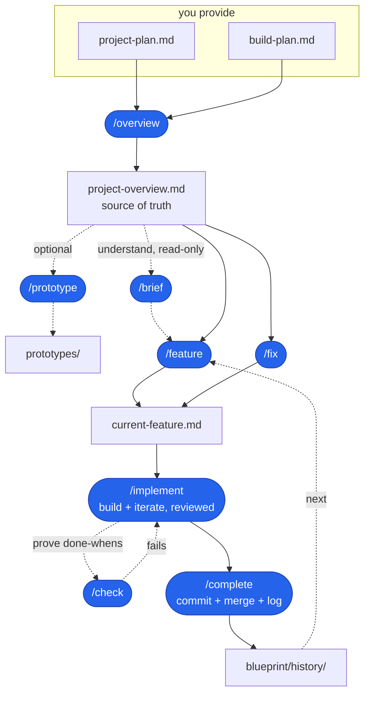

# AI Coding Blueprint

A starter and repeatable workflow for building real software with an AI assistant,
**without vibe coding**.

You provide two short planning docs. The AI turns them into project context,
feature specs, and build steps. You build one feature at a time, review every
spec before code exists, and review every diff before it lands.

## What this is

Vibe coding is describing a vague thing and accepting whatever the AI returns.
It is fast until it is not: you end up with code nobody understands and a project
that cannot be changed safely.

This blueprint gives the AI a controlled loop:

1. **Spec before code.** Planning skills write a spec and stop. You review it
   before a single line of code is written.
2. **Small, reviewable steps.** Each implementation step ends with something
   observable, a diff you can read, and proof that the done-when was met.
3. **One feature at a time.** `blueprint/context/current-feature.md` holds exactly
   one feature or fix. Finish it, archive it, then move on.

The point is not to type less. It is to stay in control of a codebase the AI is
helping you write.

## At a glance

| Principle | What it means |
| ---- | ---- |
| Spec first | The AI writes a feature or fix spec, then stops for review before code. |
| Small diffs | Implementation happens one reviewed step at a time, with proof each step works. |
| File-backed state | Plans, current work, and history live in markdown files, so context clears are survivable. |
| Tool adapters | Codex uses `.agents/skills`; Claude Code uses `.claude/skills`. |

## Quick start

Scaffold the app first, then overlay the blueprint on top.

> [!IMPORTANT]
> Scaffold your app first, then overlay the Blueprint. Do not run a framework
> scaffolder inside a folder that already contains Blueprint files.

**1. Scaffold your app** in a new, empty directory. Next.js is only an example
here; use any stack or scaffolder you want:

```bash
npx create-next-app@latest my-app
cd my-app
```

Make sure the app is a **git repo**. The build loop works on branches and
squash-merges. Some scaffolders run `git init` for you; if yours does not, run it
yourself:

```bash
git init
```

**2. Add the blueprint** from inside the app:

```bash
npx create-ai-blueprint@latest
```

The installer asks which adapters you want to keep:

```bash
npx create-ai-blueprint@latest -- --codex
npx create-ai-blueprint@latest -- --claude
npx create-ai-blueprint@latest -- --both
```

Prefer a local copy?

```bash
cp -R path/to/ai-blueprint/{AGENTS.md,CLAUDE.md,.agents,.claude,blueprint} .
```

This drops in `AGENTS.md`, `CLAUDE.md`, `.agents/`, `.claude/`, and `blueprint/`.
Codex reads `.agents/skills`; Claude Code reads `.claude/skills`. The npx
installer keeps your app's root `README.md` alone and puts the Blueprint workflow
docs at `blueprint/README.md`.

Manual raw overlay:

```bash
npx degit bradtraversy/ai-blueprint . --force
```

> [!WARNING]
> The raw `degit` overlay is intended for new projects that were just scaffolded.
> It can initially overwrite root files such as `README.md`, `AGENTS.md`, and
> `CLAUDE.md`, and it copies the whole source repo. If you are adding the
> Blueprint to an existing project with real content in those files, use
> `/adopt` and review conflicts before copying.

If a manual overlay puts this Blueprint README at your app root, `/onboard` will
move the workflow documentation to `blueprint/README.md` and create a small
project README stub. Your root `README.md` should describe the app, not the
workflow.

Only keep the adapter for the tool you use. Codex-only projects can delete
`CLAUDE.md` and `.claude/`. Claude Code-only projects can delete `.agents/`, but
should keep `AGENTS.md` because `CLAUDE.md` imports it.

### Which files do I need?

| Setup | Keep | Optional to delete |
| ---- | ---- | ---- |
| Codex only | `AGENTS.md`, `.agents/`, `blueprint/` | `CLAUDE.md`, `.claude/` |
| Claude Code only | `AGENTS.md`, `CLAUDE.md`, `.claude/`, `blueprint/` | `.agents/` |
| Codex and Claude Code | `AGENTS.md`, `CLAUDE.md`, `.agents/`, `.claude/`, `blueprint/` | Nothing |

> [!IMPORTANT]
> After the overlay, run `/onboard` before filling in plans or running
> `/overview`. This is the setup pass that makes the Blueprint match your actual
> project. If Claude Code was already open when the Blueprint was installed,
> restart Claude Code in that folder so the newly added project skills appear.

**3. Run onboard before anything else.** This detects the stack, updates the
Commands section of `AGENTS.md`, sets the `CLAUDE.md` project title when present,
tunes `coding-standards.md`, moves the copied Blueprint README to
`blueprint/README.md` when needed, creates a small project README stub, checks
`.gitignore`, and confirms which tool adapters you need:

```text
/onboard
```

In Codex, invoke it as `$onboard`. In Claude Code, invoke it as `/onboard`.

If Claude Code was already open when you installed the Blueprint and `/onboard`
does not appear, restart Claude Code in the project folder. Project skills in a
newly created `.claude/skills/` directory may not appear in an already running
session.

If your tool loads a personal, global, or team skill instead of the Blueprint
one, call the local skill file directly:

```text
follow .agents/skills/onboard/SKILL.md
```

For Claude Code:

```text
follow .claude/skills/onboard/SKILL.md
```

**4. Review the setup.** Skim
[blueprint/context/coding-standards.md](blueprint/context/coding-standards.md) and
[blueprint/context/ai-interaction.md](blueprint/context/ai-interaction.md). Adjust
anything `/onboard` flagged or anything that does not match how you want to work.
If something feels off, run `/doctor`; it is a read-only health check for the
Blueprint setup.

**5. Plan the app.** Fill in the two files you own:

- [blueprint/project-plan.md](blueprint/project-plan.md)
- [blueprint/build-plan.md](blueprint/build-plan.md)

The project plan can be rough notes. The build plan should become a numbered
checkbox list because the build loop uses checked and unchecked items to know
what is next. If your first pass is just bullets, `/overview` will flag that and
can propose a cleaned-up checkbox version before generating context.

**6. Generate the overview once.** This checks the two planning docs, helps shape
the build plan if needed, then turns them into
`blueprint/context/project-overview.md`, the AI-facing source of truth:

```text
/overview
```

Re-run `/overview` only when `project-plan.md` or `build-plan.md` changes.

**7. Repeat the build loop.** Once the overview exists, build one feature or fix
at a time:

```text
/feature
/implement
/check
/complete
```

That loop specs the next feature, builds it, proves it works, then archives and
merges it.

In Codex, invoke the same steps as skills (`$overview`, `$feature`, `$implement`,
`$check`, `$complete`) or ask naturally, such as "run the overview." In Claude
Code, use the slash commands shown above. If the project skills were added while
Claude Code was already running, restart Claude Code before using the slash
commands.

If a tool has a personal, global, or team skill with the same name as a Blueprint
command, tell it to follow the local Blueprint skill file directly, such as
`.agents/skills/overview/SKILL.md` or `.claude/skills/overview/SKILL.md`.

Most scaffolders need an empty folder, which is why the app comes first and the
blueprint is overlaid second. The direct overlay may replace the app's
boilerplate README with this one; `/onboard` moves the copied workflow README to
`blueprint/README.md` so the root README can belong to the app.

### Already have a codebase?

If the app already has meaningful shipped features, use `/adopt` instead of
`/onboard`. Overlay the blueprint files the same way, then run:

```text
/adopt
```

`/adopt` surveys the real repo, asks for the intent the code cannot reveal, then
generates the planning docs and coding standards from what already exists. Then
run `/overview` and continue through the normal build loop.

## The AI workflow

AI loops are popular because the assistant can plan, act, check the result, and
iterate. This blueprint turns that idea into a project workflow with human review
gates and a written history.

The repeating build loop is:

```text
/feature -> review spec -> /implement -> /check -> /complete
```

For unplanned bugs or small changes, use the fix loop:

```text
/fix "what is wrong" -> review spec -> /implement -> /check -> /complete
```

In this repo, **the build loop** means:

- **`/feature`** selects the next planned feature and writes a buildable spec.
- **`/fix`** writes a smaller spec for an unplanned bug or change.
- **`/implement`** builds the current spec one reviewed step at a time.
- **`/check`** runs the real app and proves the done-whens.
- **`/complete`** archives the spec, commits the finished work, and merges with
  your approval.

The loop is the control system. The AI can keep iterating, but only inside the
current spec, with observable checks and review gates.

The diagram shows the whole workflow. `/overview` happens after planning and only
re-runs when the plans change; the repeating loop starts at `/feature`.



## The two files you own

| File | What it is |
| ---- | ---------- |
| [blueprint/project-plan.md](blueprint/project-plan.md) | The **what and why**: problem, users, features, data, tech, monetization, and UI/UX. Answer each section in a line or two. |
| [blueprint/build-plan.md](blueprint/build-plan.md) | The **ordered feature list**: one line per feature, in rough build order. No deep detail here. |

These two files are the inputs you maintain. Draft them yourself or with the AI.
Your job is to decide and own what goes in them. The AI can help with wording,
expansion, and tradeoffs.

> [!TIP]
> Keep these files short and decisive. The overview step will turn them into more
> concrete project context.

## What gets generated

| File | Generated by | What it is |
| ---- | ------------ | ---------- |
| [blueprint/context/project-overview.md](blueprint/context/project-overview.md) | `/overview` | The single source of truth the AI reads every session, generated from the two planning docs. |
| [blueprint/context/current-feature.md](blueprint/context/current-feature.md) | `/feature` or `/fix` | The spec for the one feature or fix being built right now, including build steps and done-whens. |
| `blueprint/history/features/NN-name.md` | `/complete` | The archive of finished feature specs. |
| `blueprint/history/fixes/NN-name.md` | `/complete` | The archive of finished fix specs. |

Fix the planning docs, then regenerate. Do not hand-edit generated context unless
the skill tells you to.

> [!WARNING]
> Treat generated context as downstream output. When the plan changes, update the
> planning docs and re-run the relevant skill instead of patching generated files
> by hand.

## Using the workflow

After `/onboard` and after filling in the two planning docs, run `/overview`. It
checks that the plans are usable, proposes a normalized checkbox build plan if
needed, distills the docs into `blueprint/context/project-overview.md`, and
reports contradictions or gaps under **Open questions**. Answer those questions
in the plans, then re-run `/overview`.

If you are unsure whether setup is complete, the plans are ready, or the overview
is current, run `/doctor`. If setup is healthy and you just need to know where
the build loop stands, run `/status`.

Then repeat the build loop for each feature:

1. Optionally run **`/brief`** first to preview what the next feature involves -
   scope, dependencies, size - without writing anything. Then run **`/feature`**
   to spec the next unchecked build-plan item. You can also pass a number or name,
   such as `/feature 3` or `/feature "login"`.
2. Review `blueprint/context/current-feature.md` before code is written.
3. Run **`/implement`**. It branches, builds one step, shows the diff, proves the
   done-when, and waits for approval before moving on.
4. Run **`/check`** when you want an outside proof pass against the real app.
5. Run **`/complete`** when the feature is done. It archives the spec, checks off
   the build plan, commits the finished work, and squash-merges with your
   go-ahead.

### Fixes

Use `/fix` instead of `/feature`:

```text
/fix "password reset email never sends"
```

If you already described the problem in chat, `/fix` can use that context. It
needs an argument or clear problem statement; it does not scan the app and
magically know what to fix.

Then continue with `/implement`, `/check`, and `/complete`. Fixes are logged to
`blueprint/history/fixes/` and do not change `build-plan.md`.

## Command reference

| Skill | Run it | Does |
| ----- | ------ | ---- |
| **/onboard** | once, after overlaying onto a fresh or early project | Detects the stack, moves the copied Blueprint README when needed, updates commands and conventions, checks `.gitignore`, and tells you what to fill in before `/overview`. |
| **/doctor** | any time, especially after `/onboard` or when setup feels off | Runs a read-only health check for Blueprint files, adapters, commands, root README placement, ignore rules, planning readiness, overview freshness, workflow drift, and git state. |
| **/adopt** | once, for an existing codebase | Surveys the repo, protects the project README, and generates the planning docs and coding standards from what already exists. |
| **/overview** | after writing or editing the plans | Checks plan quality, normalizes rough build-plan bullets when approved, and generates `blueprint/context/project-overview.md`. |
| **/brief** | before spec'ing, or when deciding what's next | Read-only briefing on an upcoming build-plan feature - scope, dependencies, what it touches, size, likely split - without writing anything. |
| **/feature** | for each planned feature | Specs the next unchecked feature, or a selected feature, into `current-feature.md`. |
| **/fix** | for an unplanned bug or small change | Specs an ad-hoc fix into `current-feature.md`. |
| **/tests** | when you want unit tests added | Adds or normalizes the stack-native unit test setup, adds one example test, updates `AGENTS.md`, and runs build plus tests. |
| **/implement** | after reviewing a spec | Builds the current spec one small, reviewed step at a time. |
| **/check** | before wrapping up, or any time you want proof | Runs the real app and reports pass/fail against the spec's done-whens. |
| **/audit** | before closing a feature, or any time quality feels suspect | Runs a read-only code quality audit for duplication, dead code, DRY issues, standards drift, missing tests, and maintainability risks. |
| **/complete** | when work is built and reviewed | Archives the spec, commits the finished work, and merges with your approval. |
| **/prototype** | before the build loop | Creates throwaway static mockups to explore the look and feel. |
| **/status** | any time | Shows build-plan progress, current work, overview freshness, git state, workflow drift warnings, and the suggested next action. |
| **/autopilot** | experimental, explicit opt-in only | Runs one bounded spec/build/check pass without pausing after each passing implementation step, then stops with a review packet before `/complete`. |

These commands are the structured path, not a cage. You can describe a feature,
fix, or change directly in chat at any time. Use the skills when you want the
repeatable loop, review gates, and history.

### Experimental: Autopilot

`/autopilot` or `$autopilot` is an experimental, explicit opt-in mode for one
bounded pass. It can pick or resume a feature, write the spec when needed,
implement small steps, run build/tests/checks, create checkpoint commits on the
feature branch after passing steps, self-review the diff, and stop with a review
packet.

Autopilot does not replace the normal workflow. `/feature`, `/implement`,
`/check`, and `/complete` remain the conservative default.

Autopilot always stops before `/complete`, merge, push, deploy, publish, send,
destructive actions, or any action that needs a product decision not covered by
the docs.

## Testing

Testing is opt-in. The blueprint installs no test runner because it does not know
your stack, but adding one is a normal workflow task.

> [!NOTE]
> Tests become a required gate only after you add a real `test` command to the
> Commands section of `AGENTS.md`.

To add unit testing, run:

```text
/tests
```

The agent should pick the stack-native runner, reuse an existing runner if one is
already present, wire the scripts or commands, add a small example test, and
update the **Commands** section of `AGENTS.md`. For a TypeScript app that usually
means Vitest; Python might use pytest, and Go already has `go test`.

`/tests` is a setup command, not a product feature. It should not try to write a
broad test suite for existing code. It proves the runner works, documents the
command, and turns on the testing gate for future logic-bearing work.

Once a runner is configured, tests become a gate for logic-bearing steps:
parsers, validators, server actions, formatters, and similar work should include
a passing test in the same diff. UI and integration work can ride on screenshot,
browser, build, or API evidence from `/implement` and `/check`.

For browser-heavy work, Playwright is preferred when the project already has it
installed or declares a Playwright command. The blueprint does not install it by
default; adding browser automation is a normal setup task when a project wants
that level of verification.

## Code quality audits

`/check` proves the app does what the spec promised. `/audit` reviews the code
itself.

Run `/audit` when you want a read-only maintainability pass before closing a
feature, after an Autopilot run, or whenever the code feels like it may be
drifting. It looks for issues such as duplicated logic, dead code, unused exports,
overgrown modules, inconsistent patterns, missing tests for logic-bearing code,
security risks, performance risks, and drift from `coding-standards.md`.

`/audit` reports findings with severity and file references. It does not edit
files, install tools, commit, merge, or push. Fixes stay in `/implement` or a
separate `/fix`.

## Picking up where you left off

You do not need a separate save/load command. The blueprint keeps project state
in files, not the conversation:

- `blueprint/context/project-overview.md` is the source of truth.
- `blueprint/context/current-feature.md` is the in-progress spec.
- `blueprint/build-plan.md` says what is done and what is next.
- `blueprint/history/` plus git keeps the build history.

You can clear context any time. Between features, run `/feature` for the next
item. Mid-feature, run `/implement` again and it resumes from the first unchecked
step in `current-feature.md`.

> [!TIP]
> If you are unsure what to do next, run `/status`. To understand what a specific
> upcoming feature involves before spec'ing it, run `/brief`. If you are unsure
> whether the Blueprint is set up correctly, run `/doctor`. All three are read-only.

## File map

```text
.                              (your app: src/, package.json, README.md, ...)
├── CLAUDE.md                  (Claude Code entry; imports AGENTS.md + context)
├── AGENTS.md                  (agent instructions for Codex, Cursor, and others)
├── .agents/
│   └── skills/                (Codex repo skills)
│       ├── adopt/             ($adopt: bootstrap from an existing codebase)
│       ├── doctor/            ($doctor: read-only Blueprint health check)
│       ├── onboard/           ($onboard: finish fresh-project setup)
│       ├── overview/          ($overview: plans to project-overview.md)
│       ├── brief/             ($brief: preview a build-plan feature)
│       ├── feature/           ($feature: build-plan item to current-feature.md)
│       ├── fix/               ($fix: document an ad-hoc fix)
│       ├── tests/             ($tests: add unit testing)
│       ├── implement/         ($implement: build the current spec)
│       ├── check/             ($check: prove the done-whens)
│       ├── audit/             ($audit: code quality review)
│       ├── complete/          ($complete: commit, merge, and log)
│       ├── prototype/         ($prototype: static mockups)
│       ├── status/            ($status: where things stand)
│       └── autopilot/         ($autopilot: experimental bounded pass)
├── .claude/
│   └── skills/                (Claude Code skills and slash commands)
│       ├── adopt/             (/adopt: bootstrap from an existing codebase)
│       ├── doctor/            (/doctor: read-only Blueprint health check)
│       ├── onboard/           (/onboard: finish fresh-project setup)
│       ├── overview/          (/overview: plans to project-overview.md)
│       ├── brief/             (/brief: preview a build-plan feature)
│       ├── feature/           (/feature: build-plan item to current-feature.md)
│       ├── fix/               (/fix: document an ad-hoc fix)
│       ├── tests/             (/tests: add unit testing)
│       ├── implement/         (/implement: build the current spec)
│       ├── check/             (/check: prove the done-whens)
│       ├── audit/             (/audit: code quality review)
│       ├── complete/          (/complete: commit, merge, and log)
│       ├── prototype/         (/prototype: static mockups)
│       ├── status/            (/status: where things stand)
│       └── autopilot/         (/autopilot: experimental bounded pass)
└── blueprint/
    ├── README.md             (workflow docs after /onboard moves them)
    ├── project-plan.md        (you write: what and why)
    ├── build-plan.md          (you write: ordered feature list)
    ├── context/
    │   ├── project-overview.md  (generated by /overview)
    │   ├── coding-standards.md  (your conventions)
    │   ├── ai-interaction.md    (how the AI works with you)
    │   └── current-feature.md   (generated by /feature or /fix)
    └── history/
        ├── features/          (completed feature specs)
        └── fixes/             (completed fix specs)
```

`AGENTS.md`, `CLAUDE.md`, `.agents/`, and `.claude/` stay at the repo root
because the tools that read them look there. Everything else owned by the
workflow lives under `blueprint/`, so it stays out of your app code.

When editing shared workflow behavior, keep the matching files in `.agents/skills`
and `.claude/skills` aligned. Tool-specific invocation text is fine, but the
actual build loop should stay the same across both adapters.

## Notes

### This is not an app skeleton

There is no root app `package.json` in the install overlay. Scaffold the app
first with whatever stack you like, then overlay these files. That keeps the
workflow stack-agnostic: the same process can guide a Next.js app, a Vite SPA, a
Python service, or something else.

The npm installer package lives under `packages/create-ai-blueprint/` in this
source repo. The npx installer does not copy that package into your app.

The defaults in `coding-standards.md` assume Next.js, TypeScript, Tailwind, and
Prisma. Change them to match your project. To keep the overlay conflict-free, the
blueprint avoids root files a framework scaffold usually creates, like
`.gitignore`, `package.json`, lockfiles, `tsconfig.json`, or `eslint.config.mjs`.

### Prototyping is separate

Locking the look with mockups, Figma, v0, or static HTML is exploratory work. Do
it before the build loop and let the result inform the UI/UX section of your
project plan. The `/prototype` helper can create throwaway static mockups in
`prototypes/`.

### Works in other tools

The blueprint is not Claude-specific. `AGENTS.md` is the cross-tool entry point,
`.agents/skills` exposes the workflow to Codex, and `.claude/skills` exposes it
to Claude Code.

You do not have to keep both adapters. For Codex-only work, keep `AGENTS.md`,
`.agents/`, and `blueprint/`. For Claude Code-only work, keep `AGENTS.md`,
`CLAUDE.md`, `.claude/`, and `blueprint/`. Keep both adapters if you switch
between tools.

Use the native invocation style for your tool:

- Codex: `$onboard`, `$overview`, `$feature`, `$tests`, `$implement`, `$check`,
  `$audit`, `$complete`, or plain language like "run the overview." Experimental:
  `$autopilot`.
- Claude Code: `/onboard`, `/overview`, `/feature`, `/tests`, `/implement`,
  `/check`, `/audit`, `/complete`. Experimental: `/autopilot`.
- Other tools: ask the agent to follow the matching `SKILL.md`.

```text
run the overview by following .agents/skills/overview/SKILL.md
```
